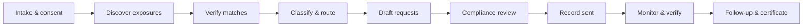

# ClearTrace — Product Overview

**Version 0.5.0** · Owner-controlled privacy remediation

---

## One-liner

ClearTrace helps authorized individuals and teams **find public exposures, file factual removal requests, verify takedowns, and prove what happened** — with an auditable case file, your own API keys, and optional automation.

---

## Who it's for

| Audience | Use case |
|----------|----------|
| **Individuals** | Remove outdated people-search listings, broker profiles, or public-record snippets tied to your identity |
| **Families & caregivers** | Act with documented authority for a dependent or estate subject |
| **Privacy-conscious professionals** | Manage personal-brand exposure without handing data to a black-box service |
| **Small privacy / reputation teams** | Run structured cases with SLA tracking, broker sweeps, and API integrations |
| **Self-hosters & integrators** | Deploy on your infrastructure; bring every external API key yourself (BYOK) |

---

## The problem

Public personal data spreads across dozens of brokers, people-search sites, and record aggregators. Removal is fragmented: every site has a different opt-out path, tone requirements, and follow-up window. Most “privacy services” obscure what they send, who they contact, and whether work was actually done.

**ClearTrace inverts that model:** you stay in control of credentials, approvals, outbound messages, and the audit trail.

---

## What ClearTrace does (end to end)



1. **Intake** — Encrypted identity signals, authority attestation, scoped discovery preferences  
2. **Discovery** — Demo mode (no keys) or live SERP via your search API  
3. **Verification** — Confirm candidates; SSRF-safe live URL checks  
4. **Controller resolution** — Rules-based classify + official removal path (broker playbooks)  
5. **Drafting** — Factual removal templates; optional LLM polish (BYOK)  
6. **Compliance** — Human-in-the-loop checklist before anything goes out  
7. **Outbound** — Copy, mailto, Gmail draft push, or opt-in connector send  
8. **Monitoring** — Scheduled re-checks for resurfacing content  
9. **Proof** — Case export, timeline, removal certificate  

---

## Capability pillars

### 1. Case command center

- **Dashboard** — Exposure radar, action items, connector health, recent audit activity  
- **Case workflow UI** — Full intake → verification pipeline in one surface  
- **Intake wizard** — Title, case type, discovery scopes, authority basis, encrypted claims  
- **Guide panel** — Step-by-step operational guidance aligned to 20 skills  
- **Agent handoff packs** — Export context for external agents without leaking secrets  
- **Batch remediation** — Queue multiple exposures through classify → draft steps  
- **Case export & removal certificate** — Portable evidence of work performed  

### 2. Discovery & verification

| Capability | Detail |
|------------|--------|
| **Demo discovery** | Works immediately — no API keys required |
| **Live SERP** | SerpAPI, Bing Web Search, Google Custom Search (BYOK, Pro when billing enabled) |
| **Broker universe** | 50+ data brokers & people-search sites with opt-out URLs |
| **Broker sweep** | Scan case scopes + known URLs against the broker universe; returns ranked matches and opt-out links (Pro) |
| **Live URL check** | SSRF-protected fetch for verification and evidence capture |
| **Content matching** | Confidence scoring for candidate ↔ claim alignment |

### 3. Remediation & drafting

- **Rules-based classification** — Exposure class, sensitivity, remedy family  
- **Broker playbooks** — Automatic controller/contact resolution for known brokers  
- **Removal templates** — Factual, jurisdiction-aware draft variants  
- **LLM polish (optional)** — OpenAI, Anthropic, or OpenRouter — draft assistance only, BYOK  
- **Compliance gate** — No automated send without explicit user approval  
- **Gmail draft push** — OAuth BYOK; drafts land in the user's Gmail for final send  
- **Email auto-send (opt-in)** — SMTP, Resend, SendGrid, or Postmark on Pro when enabled in Agent defaults  
- **Follow-up rules** — Configurable cadence after initial outbound  

### 4. Hermes workflow engine

Ten-step automated pipeline with honest status transitions:

1. Intake & consent  
2. Discover  
3. Verify match  
4. Resolve controller *(classify + route inline)*  
5. Draft  
6. Compliance  
7. Record sent  
8. Schedule monitoring  
9. Verify removal  
10. Follow-up  

**20-skill registry** — Markdown skill pack synced at build; operational, onboarding, and template skills with clear `implementedInApp` honesty flags.

### 5. Enterprise & automation (Pro)

| Feature | What you get |
|---------|----------------|
| **SLA deadlines** | Tiered response, removal, follow-up, and broker opt-out clocks — auto-created when messages are recorded sent |
| **API keys** | `ct_live_…` bearer tokens for cases, broker sweep, and SLA reads |
| **Signed webhooks** | HMAC-delivered outbound events with delivery log (separate from connector webhook) |
| **Connector webhooks** | Opt-in dispatch to `generic_webhook` on key audit events (no PII in payload) |
| **Rate limits** | Per-user caps on discovery, email send, connectors, batch, and export |

### 6. Security & trust

- **BYOK everywhere** — Your search, LLM, and email credentials; encrypted per organization  
- **Encrypted identity claims** — AES-256 at rest; redacted previews in UI and audit log  
- **Hash-chained audit events** — Tamper-evident timeline per case  
- **SSRF protection** — Safe fetch on connector and webhook URLs  
- **Production guards** — Startup fails if default secrets are used in production  
- **Sentinel console** — Security scan surface for deployment hygiene  
- **No covert scanning** — Limited public research only; see Safety Boundaries in skill pack  

### 7. Deployment & operations

| Mode | Notes |
|------|-------|
| **Local dev** | SQLite, `npm run dev`, optional `.env.local` |
| **Docker / Compose** | Standalone Next.js output + worker cron service |
| **Vercel** | `vercel.json` cron for verification endpoint |
| **Self-hosted Pro** | Omit Stripe env vars → all Pro features enabled |
| **Health probe** | Public `GET /api/health` |

---

## Connectors (bring your own keys)

Configure at **Settings → Connectors**. Test on save where supported.

| Category | Providers |
|----------|-----------|
| Discovery | SerpAPI, Bing Web Search, Google Custom Search |
| Intelligence | OpenAI, Anthropic, OpenRouter |
| Email | Gmail (draft), SMTP, Resend, SendGrid, Postmark |
| Webhook | Generic webhook (opt-in event dispatch) |

---

## Plans

| | **Free** | **Pro** | **Self-hosted (no Stripe)** |
|--|----------|---------|------------------------------|
| Cases | 3 | Unlimited | Unlimited |
| Demo discovery | ✓ | ✓ | ✓ |
| Full workflow UI | ✓ | ✓ | ✓ |
| Live SERP | — | ✓ (BYOK) | ✓ (BYOK) |
| Email auto-send | — | ✓ (opt-in) | ✓ (opt-in) |
| SLA tracking | — | ✓ | ✓ |
| Broker sweep | — | ✓ | ✓ |
| API keys | — | ✓ | ✓ |
| Enterprise webhooks | — | ✓ | ✓ |
| Stripe billing | Optional | Checkout at `/billing` | N/A |

---

## Integrations at a glance

```bash
# API key (create in Settings → Enterprise)
curl -H "Authorization: Bearer ct_live_…" \
  https://your-deployment/api/cases

curl -X POST -H "Authorization: Bearer ct_live_…" \
  https://your-deployment/api/cases/{id}/broker-sweep

curl https://your-deployment/api/cases/{id}/sla \
  -H "Authorization: Bearer ct_live_…"
```

Webhook receivers verify `X-ClearTrace-Signature` (HMAC-SHA256).

---

## What ClearTrace is not

Honest boundaries matter for trust:

- **Not a dark-web scanner** — Public-source discovery and approved opt-out paths only  
- **Not a law firm** — Legal escalation skill provides templates and export; no automated legal filing  
- **Not a fully unmanaged bot** — User attestation, compliance review, and send approval are required  
- **Not a hosted data broker** — We don't store or sell identity graphs; you control the deployment and keys  

---

## Proof points (engineering)

- **125+ automated tests** — API integration, Hermes state machine, SSRF, SLA, broker sweep, webhooks  
- **Playwright E2E** — Register → intake → case creation smoke path  
- **Standalone build** — Production-ready Next.js 16 output  
- **Open packaging** — MIT license; TERMS and PRIVACY docs for operators  

---

## Positioning summary

> **ClearTrace is the control plane for personal data removal** — structured cases, your credentials, human approvals, verifiable outcomes, and optional enterprise automation when you're ready to scale beyond a spreadsheet and a pile of opt-out forms.

---

## Get started

```bash
cd cleartrace
npm install
npm run dev
```

Open [http://localhost:3000](http://localhost:3000) · Register · **New case**

For operators: see [README.md](./README.md), [docker-compose.yml](./docker-compose.yml), and [CHANGELOG.md](./CHANGELOG.md).